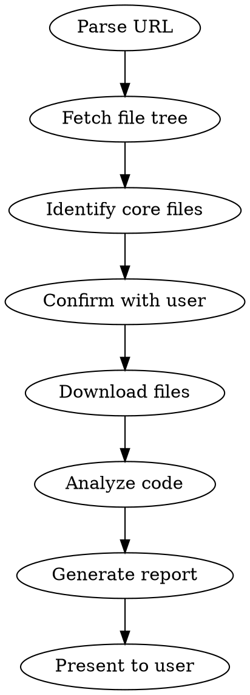

# Deep Repository Research

## Overview

Standardize repository research into a repeatable workflow. Given a repo URL, automatically fetch the most important source files, analyze architecture and deployment patterns, and produce a structured Markdown report.

## When to Use

- User says "调研一下 https://github.com/xxx/xxx"
- User wants to understand how a project works internally
- User asks for a deployment guide for a specific repository
- User wants architecture analysis of an open-source project

## Workflow



### Step-by-Step

1. **Parse URL**: Extract platform (GitHub/GitLab), owner, repo, branch.
2. **Fetch file tree**: Run `python scripts/fetch_repo.py <url> --list-only > repo_tree.json`
3. **Identify core files**: Run `python scripts/analyze_structure.py repo_tree.json > core_files.json`
4. **Confirm with user** (unless `--auto` flag): Show top 15 files, ask if they want to add/remove any.
5. **Download files**: Run `python scripts/fetch_repo.py <url> --files core_files.json --output-dir contents/`
6. **Analyze code**: Read downloaded files. Identify:
   - Architecture pattern (MVC, microservices, monolith, serverless)
   - Request data flow (entry -> routing -> business logic -> storage)
   - Key components and their single responsibility
   - Technology stack (language, framework, database, build tool)
   - Deployment method (Docker, systemd, cloud-native, etc.)
   - Configuration (environment variables, config files)
7. **Generate report**: Write `analysis_result.json` and run `python scripts/generate_report.py analysis_result.json --style <style>`
8. **Present to user**: Show the generated Markdown report.

### Command Syntax

```
/github-research <repo-url> [--style overview|architecture|deployment|full] [--auto] [--max-files N]
```

## Quality Standards

### What to Include

- **Overview**: 1-2 sentence high-level summary. NO exhaustive feature lists.
- **Architecture**: Name the pattern. Describe the request data flow end-to-end. Each component gets a single-responsibility description.
- **Deployment**: Concrete steps. Real environment variable names from config files. Real Docker commands if Dockerfile exists.
- **Code Analysis**: For each file, explain WHAT it does and WHY it matters. Quote short snippets (<30 lines). Skip boilerplate.

### What to Skip

- Do NOT list every dependency.
- Do NOT paste entire files.
- Do NOT guess at features not visible in code.
- Do NOT include test files unless they reveal architecture.
- Do NOT exceed the max-files limit (default 15) without user approval.

## Token Budget

- Default max files: 15
- Default max lines per file: 200 (truncate if longer, note the truncation)
- For very large repos (>1000 files), rely more on structure inference and less on deep code reading

## Authentication

- Public repos: No token needed (but may hit rate limits)
- Private GitHub repos: Set `GITHUB_TOKEN` env var
- Private GitLab repos: Set `GITLAB_TOKEN` env var

## Error Handling

| Scenario | Action |
|----------|--------|
| 404 Not Found | Suggest checking URL spelling and repo visibility |
| 403 Rate Limited | Advise setting token for higher limits |
| Binary file encountered | Skip with note in report |
| File too large (>500KB) | Truncate to first 200 lines, note truncation |
| Empty repository | Report that repo appears empty |

## Report Styles

- **overview**: Brief project intro + tech stack (2-3 min read)
- **architecture**: Deep architecture + data flow + key source analysis (5-8 min read)
- **deployment**: Deployment methods + config + examples (5 min read)
- **full**: Complete report combining all above (10-15 min read)
